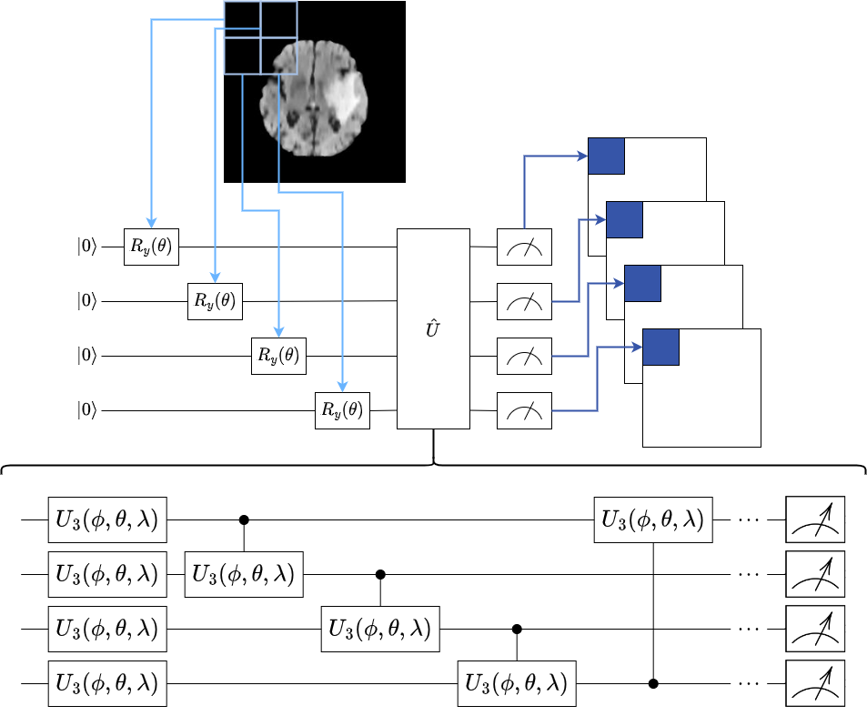
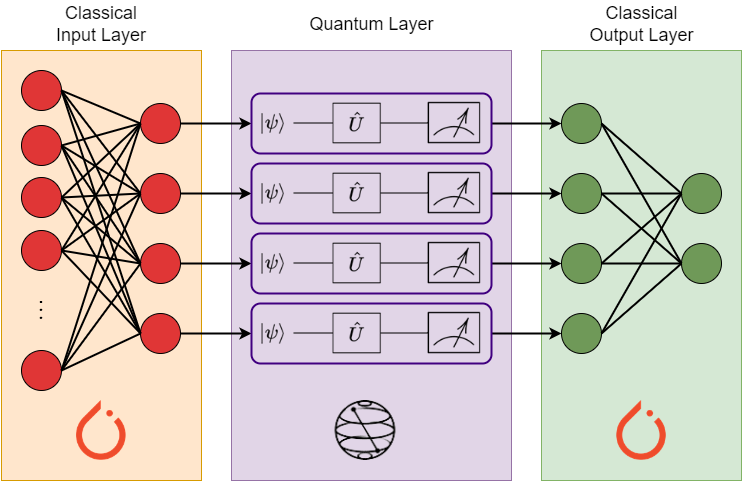
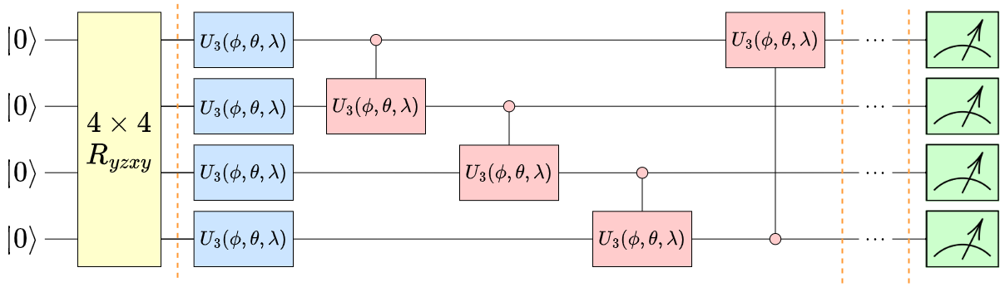

# MSci Project: Classification of Brain Scans with Quantum Machine Learning

## Introduction

In this project, we created quantum machine learning models that classified images in the SMIR BRATS 2015 dataset of brain scans based on the presence of a tumour.
We used the Quanvolution algorithm for feature extraction, and created hybrid quantum-classical neural networks for classification. 
Initially, we analysed these algorithms separately to understand what factors affected their performance and identify any avenues in which they achieve a quantum
advantage.
We later formed complete models that used quantum algorithms at each step of the pipeline and compared them to their classical counterparts. We created a fully quantum
model with a final accuracy of 85.92% and a loss of 0.329. It's classical counterpart had a final accuracy of 81.81% and a loss of 0.429. Both models had a similar 
structure and size, only the method of computation was different. Here, we present the code from our project.

## Dependencies

This project was written completely in Python 3.7, it should be noted that Python 3.9 is **not** compatible with some of the libraries used. Below are the libraries that
we used:
- Numpy
- PyTorch and TorchVision
- Pandas
- TQDM
- Matplotlib
- TorchQuantum (can be found [here](https://github.com/mit-han-lab/torchquantum))
- Qiskit

## Algorithms

The Quanvolution algorithm encodes a section of the image and performs a unitary operator $\hat{U}$ that requires $n$ qubits. The result of measuring each qubit produces
 a pixel in each of the $n$ feature maps. Applying this across the entire image gives a full feature map.
 
 
 
 The Quantum Neural Network (QNN) replaces the hidden layer of a classical neural network with a series of quantum circuits, called quantum perceptrons. Each circuit
  has alternating rotation ($R_y$) and entanglement ($CNOT$) blocks to make use of quantum natural gradient descent.
 

The Quantum Fully Connected (QFC) layer uses $U_3$ and $CU_3$ gates as rotation and entanglement blocks, respectively. This form of the circuit uses quantum natural 
gradient descent to classify the image. The encoding block at the beginning of the circuit efficiently encodes the feature maps from the quanvolution into quantum states.

## Repository

This repository contains many files but the following are the most important:
- `brain_cancer_output`: this folder contains the SMIR BRATS 2015 dataset
- `quanvolutional_filter.py`: this file contains the source code for the Quanvolution algorithm, QFC, and a quantum classifier
- `QNN_Final.py`: this file contains the source code of the QNN
- `QNN_Final2.py`: this file contains the source code of the QNN, but the circuit is replaces with a U3CU3 circuit from the QFC
- `quanv_classical.py`: this file contains the experiments performed on the Quanvolution algorithm
- `QNN_Run.py`: this file contains the experiments performed on the QNN
- `full_model.py`: this file contains the fully quantum models that use quantum algorithms throughout. It also contains the comparison with their classical counterparts.
